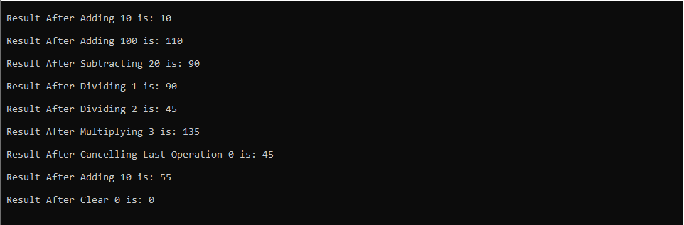

# Small Calculator Project

## Project **Description:**

This project is a simple calculator implemented in C++. The calculator supports basic arithmetic operations such as addition, subtraction, multiplication, and division. It also includes functionality to clear the result, cancel the last operation, and retrieve the final result.

The class clsCalculator contains the following data and method members:

### Data Memebers

1. `_Result`:

   - **Type:** float
   - **Role:** Stores the current result of the calculator operations.

2. `_LastOperation`:

   - **Type:** string
   - **Role:** Keeps track of the last operation performed (e.g., addition, subtraction, multiplication, division, clear, cancel).

3. `_LastNumber`:

   - **Type:** float
   - **Role:** Stores the last number involved in the operation.

4. `_PreviousResult`:

   - **Type:** float
   - **Role:** Stores the result before the most recent operation, used for the "CancelLastOperation" functionality.

### Method Memebers

1. `Add(float Number)`:

   - **Description:** Adds the given number to the current result.
   - **Requirements:**
     <br> - Accepts a float parameter Number representing the value to be added.
     <br> - Updates the internal state of the calculator by adding Number to the current result.
     <br> - Updates \_LastOperation to indicate the addition.

2. `Subtract(float Number)`:

   - **Description:** Subtracts the given number from the current result.
   - **Requirements:**
     <br> - Accepts a float parameter Number representing the value to be subtracted.
     <br> - Updates the internal state of the calculator by subtracting Number from the current result.
     <br> - Updates \_LastOperation to indicate the subtraction.

3. `Multiply(float Number)`:

   - **Description:** Multiplies the current result by the given number.
   - **Requirements:**
     <br> - Accepts a float parameter Number representing the value to be multiplied.
     <br> - Updates the internal state of the calculator by multiplying the current result by Number.
     <br> - Updates \_LastOperation to indicate the multiplication.

4. `Divide(float Number)`:

   - **Description:** Divides the current result by the given number. Handles division by zero by defaulting to 1.
   - **Requirements:**
     <br> - Accepts a float parameter Number representing the divisor.
     <br> - Handles division by zero by setting Number to 1 if it is zero.
     <br> - Updates the internal state of the calculator by dividing the current result by Number.
     <br> - Updates \_LastOperation to indicate the division.

5. `Clear()`:

   - **Description:** Resets the calculator, setting the result to zero.
   - **Requirements:**
     <br> - Clears all previous calculations and sets \_Result to zero.
     <br> - Updates \_LastOperation to indicate a clear operation.

6. `CancelLastOperation()`:

   - **Description:** Reverts to the previous result, canceling the last operation.
   - **Requirements:**
     <br> - Restores the previous result stored in \_PreviousResult.
     <br> - Clears \_LastNumber and updates \_LastOperation to indicate the cancellation.

7. `GetFinalResult()`:

   - **Description:** Retrieves the final result.
   - **Requirements:**
     <br> - Returns the current result (\_Result) as a float.

8. `PrintResult()`:
   - **Description:** Prints the result and details of the last operation.
   - **Requirements:**
     <br> - Outputs a formatted string to the console indicating the result, the last operation, and the last number involved in the operation.
     <br> - Example output: "Result after Adding 10 is: 10."

## Project Structure:

The project consists of a single C++ source file (small-calculator.cpp) containing the calculator implementation.

## main() Example Code:

```
int main()
{
    clsCalculator Calculator1;

    Calculator1.Clear();

    Calculator1.Add(10);
    Calculator1.PrintResult();

   Calculator1.Add(100);
    Calculator1.PrintResult();

    Calculator1.Subtract(20);
    Calculator1.PrintResult();

    Calculator1.Divide(0);
    Calculator1.PrintResult();

    Calculator1.Divide(2);
    Calculator1.PrintResult();

    Calculator1.Multiply(3);
    Calculator1.PrintResult();

    Calculator1.CancelLastOperation();
    Calculator1.PrintResult();

    Calculator1.Add(10);
    Calculator1.PrintResult();

    Calculator1.Clear();
    Calculator1.PrintResult();

    system("pause>0");
    return 0;
}
```

## Example Output:


